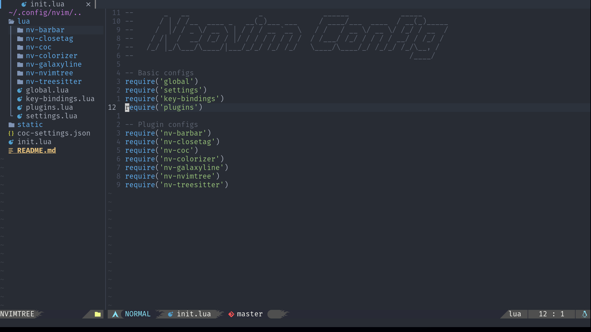

# Screenshots




# Install in one command

Make sure you have the newest version of Neovim and Nerd Font.

```bash
bash <(curl https://raw.githubusercontent.com/Tai-Github/nvim/master/media/installer/install.sh)
```
After install all plugins, you need to reload nvim make everything work.
