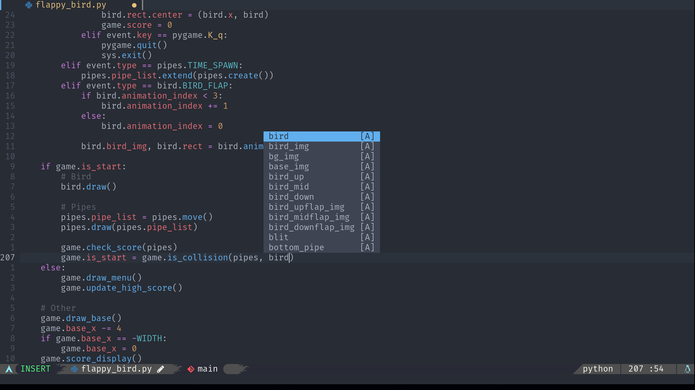

# Screenshots




# Install in one command

Make sure you have the newest version of Neovim and Nerd Font.

```bash
curl https://raw.githubusercontent.com/Tai-Github/nvim/master/media/installer/install.sh | bash
```
After installation run `nvim +PackerInstall` and wait for it install some plugin.
